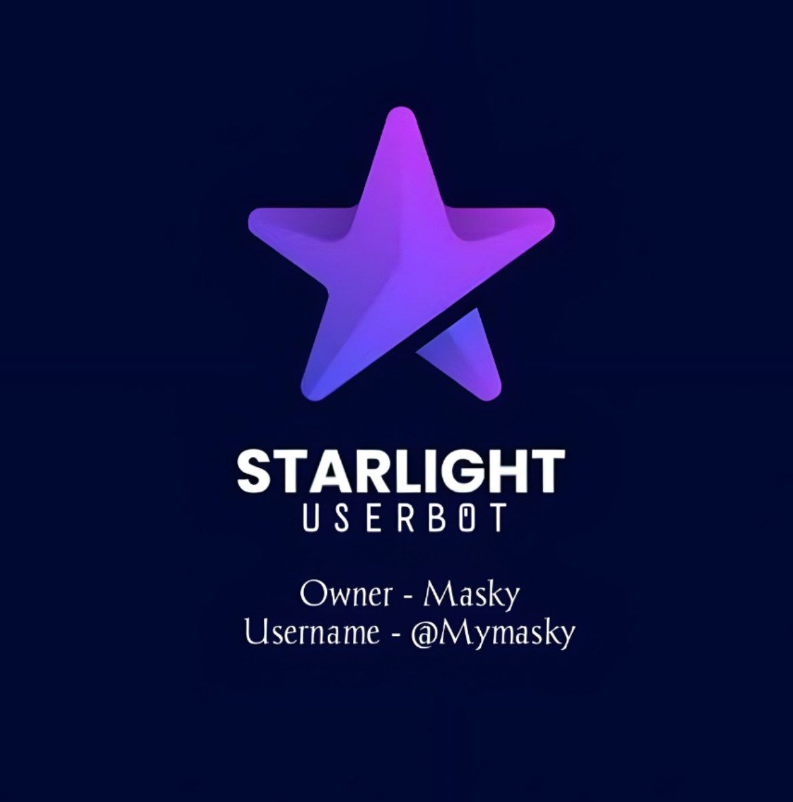

<p align="center">
  
</p>
<h1 align="center">
  <b>иᴀʏᴀ ꭙ ᴜꜱᴇʀʙᴏᴛ​</b>
</h1>

<b>A stable pluggable Telegram userbot + Voice & Video Call music bot, based on Telethon and Pyrogram</b>

[](https://img.shields.io/github/last-commit/naya1503/Naya-Userbot?color=red&logo=github&logoColor=blue&style=for-the-badge)
[](https://github.com/naya1503/Naya-Userbot)
[](https://GitHub.com/naya1503/Naya-Userbot/graphs/commit-activity)
[](https://app.codacy.com/gh/naya1503/Naya-Userbot/dashboard)
[](https://github.com/naya1503/Naya-Userbot/fork)
[](https://github.com/naya1503/Naya-Userbot/stargazers)
----

## Disclaimer

```
Saya tidak bertanggung jawab atas penyalahgunaan bot ini.
Bot ini dimaksudkan untuk bersenang-senang sekaligus membantu anda
mengelola grup secara efisien dan mengotomatiskan beberapa hal yang membosankan.
Gunakan bot ini dengan risiko Anda sendiri, dan gunakan userbot ini dengan bijak.
```

# DATABASE REQUIRETMENTS CHOOSE ONE :
- MONGODB
- REDIS

# Tutorial To Get Redis DB URL and Password


## Process For Creating DB :-   
- Go To [Redis.com](Https://redis.com) and click "`Try Free`" in Top Right Corner.   
- Fill All The Required Details Like email, first and last name, password, etc.   
- Tick Below "I agree the corresponding...Privacy Policy." and Click "Get Started".   
- Now Check Your Email, and click the "Activate Now" sent by redislabs via email.   
- Now Login and Chose Free Plan in "Fixed Size" Area and Write any name in "Subscription Area".   
- On the Next Page Write Database Name and click Activate.   
   
> Congrats! Your DB has been created 🥳   
   
## Process For Getting DB Credentials:-   
- Wait 5 mins after DB creation.   
- Then There Would Be 2 Things Named "`Endpoint`" and "`Access Control & Security`".   
- Copy Both Of Them and Paste Endpoint url in `REDIS_URI` and "Access ...Security" in `REDIS_PASSWORD`.   


<details>
<summary><b>🔗 Deploy Via Screen</b></summary>
<br>

 • `git clone https://github.com/naya1503/Naya-Userbot`

 • `cd Naya-Userbot`

 • `bash installer.sh`

 • `nano .env`
  - Jika anda menggunakan mongodb maka isi pada .env MONGO_URI tetapi jika anda menggunakan redis maka isi REDIS_URI dan REDIS_PASSWORD
  - isi vars .env API_ID, API_HASH, DAN SESSION
  - Jika sudah 
  - ketik ctrl + S
  - ctrl + X

 • `screen -S naya`

 • `bash start`

</details>

<details>
<summary><b>🔗 Deploy Via Docker</b></summary>
<br>

 • `git clone https://github.com/naya1503/Naya-Userbot`

 • `cd Naya-Userbot`

 • `nano .env`
  - Jika anda menggunakan mongodb maka isi pada .env MONGO_URI tetapi jika anda menggunakan redis maka isi REDIS_URI dan REDIS_PASSWORD
  - isi vars .env API_ID, API_HASH, DAN SESSION
  - Jika sudah 
  - ketik ctrl + S
  - ctrl + X

 • `docker build . -t naya`

 • `docker run --name naya-userbot --env-file .env naya`

</details>

<details>
<summary><b>🔗 Deploy on Heroku</b></summary>
<br>
• Silakan isi vars yang diperlukan API_ID, API_HASH, SESSION, HEROKU_API dan HEROKU_APP_NAME

<h3 align="center">Click The Button</h3>
<a align="center" href="https://dashboard.heroku.com/new?template=https://github.com/naya1503/Naya-Userbot"></a>
</div>

</details>


#### Special Thanks To
* [Everyone](https://github.com/mrismanaziz/Man-Userbot/graphs/contributors) Who Has Helped Make This Userbot Awesome!
* [AdekMaulana](https://github.com/adekmaulana) : ProjectBish
* [RaphielGang](https://github.com/RaphielGang) : Paperplane
* [TeamUltroid](https://github.com/TeamUltroid/Ultroid) :  UltroidUserbot
* [BianSepang](https://github.com/BianSepang/WeebProject) : WeebProject
* [Sandy1709](https://github.com/sandy1709/catuserbot) : CatUserbot
* [X_ImFine](https://github.com/ximfine) :  XBot-REMIX
* [Risman](https://github.com/mrismanaziz/Man-Userbot) :  Man-Userbot
* [Koala](https://github.com/ManusiaRakitan/Kampang-Bot) : Kampang-Bot
* [Alvin](https://github.com/Zora24/Lord-Userbot) : Lord-Userbot
* [AyiinXd](https://github.com/AyiinXd/Ayiin-Userbot) : Ayiin-Userbot

## © Credits
* [TeamUltroid](https://github.com/TeamUltroid) for [Ultroid](https://github.com/TeamUltroid/Ultroid)
* [Lonami](https://github.com/LonamiWebs/) for [Telethon](https://github.com/LonamiWebs/Telethon)
* [MarshalX](https://github.com/MarshalX) for [PyTgCalls](https://github.com/MarshalX/tgcalls)
* [Risman](https://github.com/mrismanaziz) for [Man-Userbot](https://github.com/mrismanaziz/Man-Userbot)
* [AyiinXd](https://github.com/AyiinXd) for [Ayiin-Userbot](https://github.com/AyiinXd/Ayiin-Userbot)
* [Kynan](https://github.com/naya1503) for [Naya-Userbot](https://github.com/naya1503/Naya-Userbot)

## Maintained By
* [](https://t.me/kenapanan)


# License
[](LICENSE)   
Naya-Userbot is licensed under [GNU Affero General Public License](https://www.gnu.org/licenses/agpl-3.0.en.html) v3 or later.